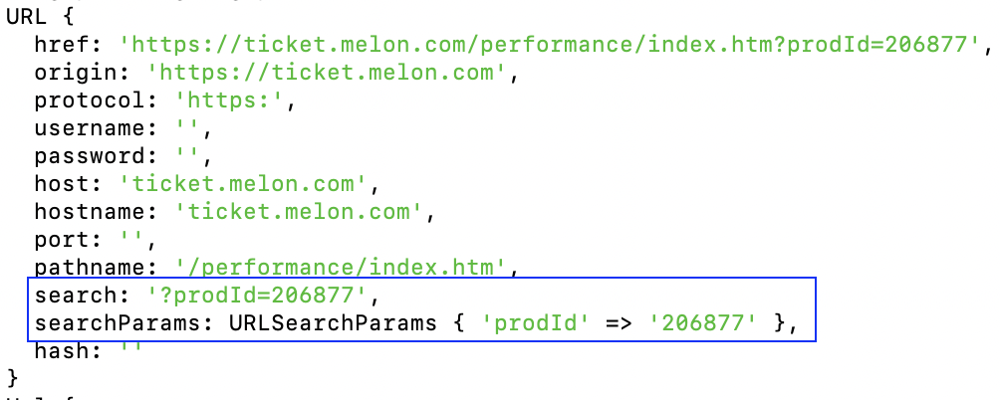
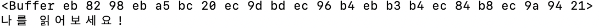
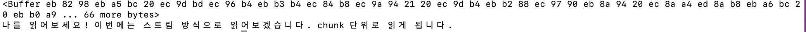
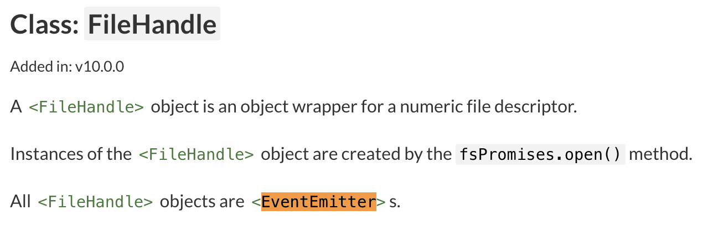
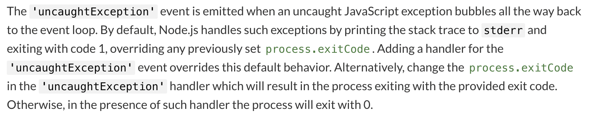

# 03-1. 노드 기능과 내장 객체

## REPL

read, eval, print, loop 의 4단계를 실행하는 REPL을 진행하여 터미널에서 즉석에서 js 코드 실행이 가능하다.

```bash
$ node
> // js 코드
```

## js 파일 실행하기

js 파일을 만든 후 터미널에서 node [파일경로]로 실행할 수 있다.

```js
// 디렉토리/hello.js

console.log('hello node!');
```

```bash
// 해당 디렉토리에서
$ node hello
hello node!
```

## 모듈

코드를 모듈로 만들 수 있다. ES6에서 추가된 js의 모듈과는 다른 노드만의 모듈 시스템이다.

노드는 **module.exports라는 객체를 가지고 있으며 이 객체는 처음에는 비어있다.**  
이제 모듈에 이것저것 추가해보자.

```js
// exam.js
const yes = '변수';
const obj = { a: 1 };
function add(x, y) {
  return x + y;
}

module.exports = { yes, obj, add };
```

module.exports 는 yes, obj, add 3개의 프로퍼티(or 메서드)를 가진 객체가 되었다. module.exports 에 객체만 대입할 수 있는 것은 아니며, 변수나 함수도 대입이 가능하다. (다만 그렇게 되면 하나밖에 내보내지를 못 하겠지)

불러올때는 require() 를 사용하면 된다. require(경로)는 경로에 있는 module.exports 객체를 반환한다.  
그럼 객체를 얻었으므로 두 가지 방법으로 불러올 수 있을 것이다. 먼저 객체를 변수에 저장하는 방법. 내보낸 것들이 객체의 프로퍼티로 존재하므로 . 연산자를 사용해서 접근하였다.

```js
// 같은 폴더
// require.js
const exmaple = require('./exam');

console.log(exmaple.obj); // { a: 1 }
console.log(exmaple.add(1, 2)); // 3
```

디스트럭처링 할당을 사용하는 두번째 방법. 각 변수에 프로퍼티가 할당되었으므로 변수 이름을 바로 사용한다.

```js
// 같은 폴더
// require.js
const { yes, obj, add } = require('./exam');

console.log(obj); // { a: 1}
console.log(add(1, 2)); // 3
```

만약에 module.exports 에 변수나 함수를 대입했다면 그냥 이름으로만 사용해야 할 것이다.

```js
// exam.js
function add(x, y) {
  return x + y;
}

module.exports = add;

// require.js
const add = require('./exam'); // 변수이름은 아무거나 해도 상관없음

console.log(add(1, 2)); // 3
```

아 이게 계속 헷갈렸었는데 정리하니까 개운하다!

## 내장 객체

별도 설치가 필요없는 내장 객체와 모듈을 지원한다.

## global

노드의 **전역 객체**로 브라우저의 window와 같은 역할을 한다. js와 마찬가지로 메서드 호출시 global을 생략 가능하다.

### console

global안에 들어있는 객체로 디버깅을 위해 사용한다. console.log(), console.error() 등 자주 쓰이는 것들이 있고 console.time(레이블), console.timeEnd(레이블)로 코드 실행 시간을 측정할 수 있는 정도 알아두면 될 것 같다.

### 타이머

타이머 또한 global 안에 들어 있으며 브라우저의 setTimeout(), setInterval()을 가지고 있다.  
브라우저와 마찬가지로 이것들은 아이디를 반환하며 이 아이디를 인자로 clearTimeout(), clearInterval()을 호출하여 취소도 가능하다.

그리고 노드에서 **추가 제공**하는 setImmediate(), clearImmediate()가 있다. 콜백 함수를 즉시 실행하는(그리고 아이디로 취소하는) 기능을 가지고 있다.

## **filename, **dirname

노드는 파일 사이에 모듈로 관계를 맺는 경우가 많으므로 현재 파일 경로에 대한 정보를 제공한다.

- \_\_filename : 현재 파일의 경로와 파일명까지 나타낸다.
- \_\_dirname : 현재 파일의 경로를 나타낸다.

## module, exports, require

- module : 모듈을 만드는데 사용되는 객체
- exports : module.exports 와 같은 객체를 참조하는 객체. module.exports 대신 사용할 수 있으나 module.exports 와는 다르게 함수나 변수를 대입할 수 없고 반드시 객체처럼 구성해야 한다. **module.exports 와 동시 사용하는 것은 좋지 않다.**
- require : 인자로 받은 경로의 모듈을 불러오는 기능을 가진 함수.

- [ ] require.cahch(), require.main() 실습

### 순환 참조

서로 다른 모듈이 서로 require() 를 하게 되면 정상적으로 실행되지 않고 해당 모듈의 module.exports 를 **오류 없이 빈 객체로 만들기 때문에** 조심해야 한다.

### 노드에서 this의 바인딩은?

- 최상위 스코프에서 : module.exports 객체
- 함수 선언문 내부에서 : global 객체

## process

현재 실행되는 노드 프로세스에 대한 정보를 담고 있는 객체이다. 많이 쓰지는 않지만 몇 가지 중요한 것들이 있음.

- process.env : 시스템 환경 변소를 출력
- process.nextTick() : nextTick의 콜백 함수가 다른 콜백 함수들보다 우선적으로 처리된다. promise도 이렇게 작동한다.
- process.exit() : 호출시 실행중인 노드 프로세스를 종료한다.

# 03-2. 내장 모듈

노드에는 다양한 기능을 제공하는 내장 모듈들이 있다. 내장이므로 별도 설치는 필요없지만 이것은 모듈이기 때문에 **사용을 위해서는 먼저 require()로 불러와야 한다.**

## os

운영체제의 정보를 제공하는 모듈

- os.cpus().length : 코어 개수 출력
- os.constants : 각종 에러, 신호에 대한 코드가 담겨 있음.

## path

폴더 경로를 조작하는 모듈이다. 윈도우 타입에서는 \ 로 경로를 구분하며, POSIX(유닉스 기반)는 / 로 경로를 구분하기 때문에 필요하며, 이외에도 여러 유용한 기능이 있다.

- parh.join() : 여러 인수를 넣으면 하나의 경로로 합쳐준다.
- path.resolve() : join 과 비슷하지만 / 를 만나면절대 경로로 인식해서 앞에 인자로 있었던 경로들을 무시한다.

## url

인터넷 주소를 쉽게 조작할 수 있도록 도와주는 모듈이다.  
url 처리는 WHATWG 방식과, 노드에서 사용하는 방식 2가지가 있는데 url를 각 파트로 분해하는 방법의 차이가 있다.

### 분해와 조립

- URL 생성자 함수 : url 모듈 내에는 URL 생성자 함수가 있는데 이 함수에 url 주소를 넣어서 인스턴스를 만들면 WHATWG 방식으로 분해된 객체를 얻을 수 있다.
- url.parse() : 노드 방식으로 url 주소를 분해해서 객체를 얻고 싶다면 이 방법을 사용한다.

- url.format() : 위의 두 방식으로 분해된 url 객체를 다시 조립한다.

### searchparams

WHATWG 방식으로 url을 분해하면 search 부분을 searchparams 라는 유용한 객체로 반환한다.



이 search 부분을 다룰수 있는 메서드를 제공한다.

### querystring

searchparamas가 없는 원래 노드 방식으로 url을 분해한 경우에 search 부분을 사용하기 쉽게 객체로 만들어주는 모듈이다.

- querystring.parse() : url의 query(부분만)를 인자로 받아서 객체로 분해한다.
- querystring.stringify() : 분해된 객체를 다시 조립한다.

## crypto

### 단방향 암호화

해시 함수라고도 부르며 복호화가 불가능한 암호화 방식이다. db에 비밀번호를 저장하는 경우 등에 유용하다.

```js
// 다음과 같이 암호화가 가능
crypto.createHash(사용할알고리즘).update(변환할문자열).digest(인코딩할알고리즘);
```

- crypto.pbkdf2() : 기존 문자열에 salt(문자열)를 붙인 후 해시 알고리즘을 여러 번 반복하는 암호화 방식, 내부적으로 스레드풀을 사용해 멀티 스레딩으로 동작한다.

### 양방향 암호화

복호화가 가능하며, 키가 존재하여 암호화 시에 사용한 것과 같은 키로만 복호화 할 수 있다.

crypto는 그 외 여러 암호화 방식을 제공한다.

## util

- util.deprecated() : 함수가 deprecated 처리되었음을 알려준다. 첫 번째 인수로 사용시 경고를 출력할 함수, 두 번쨰 인수로 경고 메시지를 넣는다.

```
deprecated : 곧 사라지게(없앨) 될 기능을 의미한다.
```

- util.promisify() : 콜백 패턴으로 사용하는 함수를 프로미스 패턴을 사용할 수 있게 바꾸어 준다.

## worker_threads

노드에서 멀티 스레드 방식으로 작업할 수 있게 해주는 모듈이다.

- [ ] 실습

## child_process

노드에서 다른 프로그램, 명령어를 수행하고 싶을 때 사용하는 모듈이다.

- [ ] 실습

# 03-3. 파일 시스템

## fs

파일 시스템에 접근하는 모듈이다.

## fs.readFile

파일을 읽어오는 매서드이다. 첫 번째 인자로 읽을 파일의 경로를, 두 번쨰 인자로 파일을 읽을 후에 실행할 콜백 함수를 넣는다.  
이 콜백 함수는 에러 발생시의 err와 실행 결과인 data를 매개변수로 받는다.

fs 모듈을 require 할 때 .promises 를 붙이면 콜백이 아닌 프로미스 기반으로 작동하는 fs 모듈을 사용할 수 있다.

### 동기 메서드와 비동기 메서드

노드의 대부분 메서드는 비동기로 이루어 진다. fs.readFile도 마찬가지로 비동기로 작동하지만, fs 모듈의 몇몇 메서드는 동기적으로 작동한다.  
예컨데 fs.readFileSync는 fs.readFile과 같은 기능을 하지만 동기적으로 작동한다.  
이런 메서드는 코드 결과를 예상하기가 쉽다는 장점이 있기는 하지만, 백그라운드가 파일 작업을 하는 동안 메인 스레드가 대기를 해야하고, 백그라운드가 여러 작업을 한꺼번에 처리할 수 있는 효율을 포기해야한다는 치명적인 단점이 있어서 보통의 경우 권장되지 않는다. (처음 실행시 초기화 하는 용도 정도로만)

비동기 방식을 사용하면서 순서대로 처리하고 싶다면 콜백 패턴을 이용하면 된다.

```js
const fs = require('fs');

fs.readFIle('./1.txt', (err, data) => {
  console.log(data);
  fs.readFile('/2.txt', (err, data) => {
    console.log(data);
  });
});
```

이 경우 메인 스레드는 파일 읽는 작업을 순차적으로 하는 동안(1.txt 읽고 완료되면 콜백이 실행되므로 그 때 2.txt을 읽기 시작함) 대기할 필요가 없이 동작이 가능하다.  
하지만 이 경우에도 백그라운드에서 작업을 동시에 하지 않는다는 아쉬운 점은 남아있다는 것인가?

콜백 헬이 문제가 된다면 promise 나 async / await로 어느 정도 보완이 가능하다.

## 버퍼와 스트림

readFile 메서드는 파일을 읽은 결과를 다음과 같이 버퍼로 반환하고, toString()을 사용해야 이해할 수 있는 문자열로 변환된다.



이 버퍼는 읽어온 파일에 할당된 메모리에 저장된 데이터인데, readFile 은 읽어올 파일의 크기만큼 메모리 공간을 확보한 후 파일을 읽어서 버퍼로 저장한다.

### buffer

버퍼를 다룰 수 있는 클래스이고 버퍼에 관련된 메소드들은 제공한다.

- Buffer.from() : 문자열을 버퍼로 바꾸어줌.
- Buffer.toString() : 버퍼를 문자열로 바꾸어줌.

버퍼는 편리하기는 하지만 몇 가지 문제저밍 있다. 파일 크기만큼 메모리 공간을 확보해야 하므로 서버 운영시 버퍼를 시용하게 되면 부담이 커지게 되고, 모든 내용을 버퍼에 다 쓰고 나서 다음 동작을 하므로 데이터에 여러 조작을 할 때 속도 면에서 손해를 본다.

이런 문제를 해결하기 위해서 스트림을 만들었는데, 버퍼를 쪼개서 여러 번에 나누어 보내는 방식을 사용하는 것이다.

## fs.createReadStream

파일을 스트림 방식으로 읽어오고 싶다면 createReadStream 메소드를 사용할 수 있다.

보통 이벤트 리스너를 붙여서 사용하게 된다.

```js
const fs = require('fs');

const readStream = fs.createReadStream('./1.txt', { highWaterMark: 16 });
const data = [];

readStream.on('data', (chunk) => {
  data.push(chunk);
  console.log(chunk);
});

readStream.on('end', () => {
  console.log(Buffer.concat(data).toString());
});

readStream.on('error', (err) => {
  console.error(err);
});
```

다음과 같이 같은 파일도 여러 번에 나누어서 읽어온다.  
readFile 사용시



createReadStream 사용시


## fs.createWriteStream

- [ ] 공부

## 파이핑

- [ ] 공부

## 기타 메서드

- [ ] 공부

## 스레드풀

앞서 살펴본 fs의 비동기 메서드들은 백그라운드에서 실행되며, 동시에 여러 개의 작업이 실행될 수가 있다. 이것을 가능하게 해 주는 것이 스레드풀로, fs, crypto, zlib 등의 모듈은 내부적으로 스레드풀을 사용하여서 작업을 한다.

스레드풀을 직접 제어할 수는 없지만 스레드풀의 개수를 (=백그라운드에서 동시에 처리할 수 있는 작업의 개수를) 조절하는 것은 가능하다.  
노드에 연결되어 I/O를 담당하는 libuv를 조작해야 한다. 다음과 같이 조작할 수 있다고 한다.

```bash
UV_THREADPOOL_SIZE=숫자
```

헌데 process.env 에 기본적으로 등록이 되어 있지는 않았다. 따로 설정하기 전에는 환경변수로 내보내지 않고 있는 것인가? 어쨋든 공식 문서에서는 기본값이 4, 최대 1024까지 가능하다고 설명하고 있다.

# 03-4. 이벤트 & 예외 처리

## 이벤트

노드는 브라우저에서의 js와 유사하게 이벤트 기반으로 작동한다고 1장에서 배웠다. fs의 stream 예제에서 보듯이 갑자기 .on 을 붙이고 이벤트 리스너를 달아서 사용하였는데, 이처럼 이벤트 기반으로 작동할 수 있게 하는 것이 events 모듈이다.  
events 모듈 내에는 **EventEmitter 라는 클래스가 있고,** 이 클래스가 .on 메서드를 포함하고 있다.

- eventEmitter.on() : 첫번째 인수로 이벤트명, 두 번째 인수로 콜백 함수를 받아서 이벤트 발생시 해당 콜백이 발생하도록 연결한다. 이것을 이벤트 리스닝이라고 부른다.

이렇게 events 모듈은 이벤트 리스닝을 하고 관리를 하는 메서드를 제공하여 직접 이벤트를 만들수가 있고,
또한 노드의 많은 모듈들은 이 **EventEmitter 클래스를 상속받고 있기 때문에 .on을 사용할 수가 있다.** 즉, createReadStream 을 다룰 때 .on을 붙일 수 있는 것은 fs 내부에서 EventEmitter 클래스를 상속받고 있는 것이 있다는 것이다.



fs 모듈 말고도 많은 모듈은 이렇게 이벤트가 등록되어 있고 이벤트 리스닝을 사용할 수 있고, 이 것을 적절히 사용해야 하는데, 다만 어떤 이름의 이벤트가 발생하고 언제 이벤트가 발생하는지 그러한 사항들은 직접 찾아서 사용하는 수 밖에 없는거 같다.

그런데 책의 예제에서 'end', 'error' 이벤트는 공식 문서에서 관련 내용을 찾을 수 있었는데 'data' 이벤트는 흔적을 찾을 수가 없었다. 어떻게 된 거지... 그래도 갑자기 왜 .on을 사용할 수 있는지에 대한 의문은 해소되었다.

## 예외 처리

노드는 싱글 스레드이므로 하나인 스레드가 멈추면 전체 프로세스가 멈추게 된다. 따라서 에외 처리의 중요성은 더욱 강조된다.  
기본적으로 js와 같이 try / catch 를 지원한다.

```js
try {
  // 에러 발생할 가능성이 있는 코드
} catch (err) {
  // 에러를 처리
  console.error(err);
}
```

## 몇 가지 경우

에러가 throw 되는 경우 프로세스가 멈추게 되는데, 노드 내장 모듈에서 발생하는 에러는 에러를 throw 하는 것이 아니므로 실행중인 프로세스를 멈추지는 않는다.  
(따라서 try / catch를 쓰지 않곡 console로 기록만 해둔 후 나중에 문제 해결을 하는 것이 가능하다.)

에러가 throw 되는 경에는 반드시 try / catch 로 처리해 멈추지 않게 하자.

또한 프로미스의 에러는 catch 하지 않아도 알아서 처리한다.

## uncaughtException

process 모듈에는 예상치 못한 에러가 발생했을 때 emit 되는 uncaughtException 이라는 이벤트가 있어서, 여기에 이벤트 리스너를 달면 처리하지 못한 에러가 발생 했을 때 콜백이 수행되고 프로세스가 멈추지 않게 된다.



이것은 어떤 에러든 처리할 수 있는 유용한 방법처럼 보이지만, 이후의 동작이 정상적으로 수행되는 지를 보장할 수 없으므로 최후의 수단으로만 사용할 것을 권장하고 있다.

## further study

- [ ] fs의 콜백 패턴 사용시 백그라운드에서는 한 번에 하나의 작업만 한다는 것임?
- [ ] 동기와 비동기, 블로킹과 논 블로킹에 대한 명쾌한 이해가 필요
- [ ] 'end', 'error' 이벤트는 있는데 'data' 이벤트는 왜 공식 문서에 찾을 수 없는 걸까
