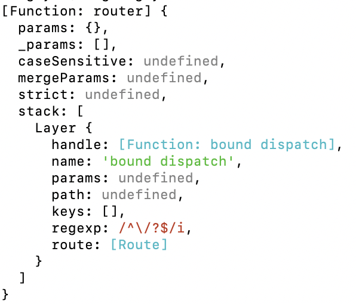

# 06. Express 로 서버 구축하기

## 익스프레스

익스프레스는 서버 제작의 편의성을 높인 웹 서버 프레임워크로 http 모듈을 내장하고 있다. npm 에서 내려받을 수 있다.

```bash
npm init
npm i express
```

## 기초

먼저 express 모듈을 볼러 오고, express 모듈의 최상위 객체인 express()를 변수 app에 할당하면서 시작한다.

- .set(키, 값) : 키, 값을 받아서 express()에 저장한다. express 안에서의 전역 변수처럼 사용할 수 있다.
- .get(키) : .set으로 저장한 값을 가져올 수 있다.
- .listen(포트, [콜백]) : 지정한 포트를 열어 http 서버를 시작한다.
- .METHOD(경로, 콜백) : http 요청에 따른 응답을 관리한다. 예컨대 밑의 예제에서는 .get 이므로 http GET 요청 중 '/' 경로로 들어오는 요청들에 한해서 콜백을 실행한다.

```js
const express = require('express');
const app = express();

app.set('port', process.env.PORT || 3000);
app.get('/', (req, res) => {
  res.send('hello world!');
});

app.listen(app.get('port'), () => {
  console.log(app.get('port'), '에서 서버 대기 중');
});
```

이외에도 app (=express())은 여러가지 메서드를 가지고 있다.

### 정적파일 응답

위의 예제에서 처럼 res.send() 로 http 응답을 보낼 수 있으며 res.sendFile(경로)로 정적 파일 응답이 가능하다.

```js
const path = require('path');

app.get('/', (req, res) => {
  //   res.send('hello world!');
  res.sendFile(path.join(__dirname, 'index.html'));
});
```

## dotenv

이 패키지는 .env 파일을 읽어서 process.env 라는 객체로 만든다.
보안이 필요한 값의 경우 소스 코드가 유출되어도 .env 만 잘 관리하고 dotenv로 불러와서 쓰기만 한다면 보안을 유지하는데 도움이 된다.

```bash
npm i dotenv
```

```
// .env
SECRET=abc
```

```js
const dotenv = require('dotenv');

dotenv.config();

console.log(process.env.SECRET); // abc
```

## 미들웨어

익스프레스의 핵심이라고 할 수 있는 미들웨어는 요청과 응답 사이에 위치하여 여러 기능을 한다.
미들웨어는 app.use(), app.METHOD() 라우터의 인자로 들어가는 **함수**이며 req, res, next 를 매개변수로 가진다.

use에서 사용될 경우 모든 요청에 대해서 미들웨어를 실행하고, METHOD의 경우 해당 http 요청 메서드에 해당하는 경우에만 미들웨어를 실행한다.  
첫 번째 인자로 주소를 넣으면 해당 주소로 시작하는 요청에서만 실행한다.

```js
app.get('/abc', 미들웨어()); // /abc 로 시작하는 요청 중에서도 get 요청에만 미들웨어()를 실행한다.
```

미들웨어에서는 next()를 호출해야 다음 미들웨어로 넘어갈 수 있다.

```js
app.use((req, res, next) => {
  next();
});
app.use((req, res, next) => {
  console.log('next 호출 안 하기!');
});
app.get((req, res, next) => {
  console.log('호출되지 않습니다.');
});
```

하나의 라우터에 여러개의 미들웨어를 장착할 수 있다.

```js
app.use(
  (req, res, next) => {
    console.log('1번 미들웨어');
    next();
  },
  (req, res, next) => {
    console.log('2번 미들웨어');
  }
);
```

next() 에 인자로 문자열 route를 넣으면 바로 다음 라우터로 이동한다.

```js
app.use(
  (req, res, next) => {
    next('route');
  },
  (req, res, next) => {
    console.log('실행되지 않음');
  }
);
app.use((req, res, next) => {
  console.log('여기로 바로 이동!');
});
```

next()에 인자로 route 이외의 인수를 (보통 err) 넣으면 에러 처리 미들웨어로 바로 이동한다.  
에러 처리 미들웨어는 특이하게 req, res, next 말고도 err 을 매개변수로 가져야 한다.

```js
app.use((req, res, next) => {
  next(err);
});
app.use((req, res, next) => {
  console.log('넘어가짐');
});
app.use((req, res, next) => {
  console.log('넘어가짐');
});
app.get((err, req, res, next) => {
  console.log('에러는 여기로.');
});
```

미들웨어는 next()를 호출하거나 http 응답을 보내야 한다. 응답을 보내면 next()를 호출하지 않고 거기서 끝난다.  
만약 둘 중 어느 것도 하지 않으면 클라이언트는 계속 응답을 기다리게만 된다.

### morgan

요청과 응답에 대한 정보를 콘솔에 출력해 준다.

```js
app.use(morgan('dev'));
```

### static

요청 경로로 http 요청을 보내면 실제 경로에 있는 정적 파일을 제공한다. 요청 경로와 실제 경로를 다르게 할 수 있어어 보안에 유리하며, res.sendFile 처럼 파일을 읽는 별도의 과정이 필요없다.

```js
app.use('http 요청 경로', express.static('실제 경로'));
```

### body-parser

http 요청의 본문을 req.body 객체에 저장해 주는 미들웨어이다.

```js
app.use(express.json());
app.use(express.unlencoded({ extended: false }));
```

이름에서 짐작 가능하듯 json 형식과 URL-encoded 방식으로 보내진 데이터를 처리할 수 있으며, 만약 이 외에 Raw, text 방식의 데이터를 처리해야 한다면 따로 body-parser를 설치해 주어야 한다.

```
npm i body-parser
```

### cookie-parser

http 요청에 동봉된 쿠키(단순 문자열)을 객체로 바꾸어서 req.cookies에 저장한다.

```js
app.use(cookieParser(비밀키));
```

이것은 받은 쿠키를 객체로 만들어 줄 뿐 쿠키를 생성하거나 제거하는 것은 아니다.  
서버의 http 응답에서 쿠키를 만들거나 삭제하고 싶다면 res.cookie() 나 res.clearCookie() 를 사용하자.

```js
res.cookie('key', 'value', {
  expires: new Date(Date.now() + 909090), // 옵션을 넣을 수 있음
  httpOnly: true,
  signed: true,
});
res.clearCookie('key', 'value', { httpOnly: true, signed: true });
// 지울 때는 키, 값, expires / maxAge 를 제외한 옵션의 값이 정확히 같아야 한다.
```

signed 라는 옵션은 쿠키 뒤에 서명을 붙일 수 있다. 그러면 cookieParser(비밀키)에서 적어두었던 인수를 비밀키로 서명을 할 수 있고, 내 서버가 쿠키를 만들었다는 증명이 되므로 유용하다.  
이렇게 서명된 쿠키는 req.cookies 가 아닌 req.signedCookies 객체에 들어가게 된다.

### express-session

세션을 관리하는 미들웨어이다.

- [ ] 실전

## 미들웨어 응용

같은 라우터 내에서 미들웨어 사이에 데이터를 전송할 수 있다.

```js
app.use(
  (req, res, next) => {
    req.data = 'new data';
    next();
  },
  (req, res, next) => {
    consol.log(req.data); // 'new data'
  }
);
```

새로운 요청이 들어오면 req 가 다시 설정되므로 그 전까지만 유효하다.

미들웨어 안에 미들웨어를 넣는 패턴이 가능하다.

```js
app.use(morgan('dev'));
// 같은 기능
app.use((req, res, next) => {
  morgan('dev')(req, res, next);
});
```

morgan('dev')는 함수이고 미들웨어이기 때문에 역시 req, res, next를 인자로 받는 함수의 형태를 하고 있다.  
따라서 바깥의 콜백 함수의 호출 부분에서 morgan 함수를 호출한 것이고 함수 호출이니 인자를 명시해 준 것 뿐이다. 따라서 생략된 부분은 풀어서 쓴 것인데 저렇게 쓴다면 분기로 미들웨어의 기능을 확장하는 것도 가능하다.

```js
app.use((req, res, next) => {
  if (process.env.NODE_ENV === 'production') {
    morgan('combined')(req, res, next);
  } else {
    morgan('dev')(req, res, next);
  }
});
```

## multer

- [ ] 공부

## Router 객체

Router 객체를 통해서 라우팅을 깔끔하게 할 수 있다. express.Router()를 모듈로 다루는 방법이다.

```js
// routes/index.js

const express = require('express');
const router = express.Router();

router.get('/', (req, res) => {
  res.send('hello world');
});

module.exports = router;
```

express.Router()는 함수로 실제로 저 코드에서 router를 콘솔로 찍어보면 다음과 같이 나온다. 이해는 잘 못하겠으나 express.Router()의 일부를 수정한 후에, 다시 모듈로 내보내는 코드라는 것 정도만 이해합시다.



이제 내보낸 모듈을 서버를 실행하는 파일 (app.js)에서 불러와서 사용하면 된다.

```js
// app.js
const indexRouter = require('./routes'); // 모듈 불러오기

app.use('/', indexRouter); // 모든 '/' 요청에 대해서 두 번째 인자인 indexRouter를 실행하겠다는 의미이다.
```

이러면 요청 주소에 따라 각각 다른 응답을 하는 라우팅을 app.js에 일일이 적을 필요 없이 깔끔하게 사용 가능하다. '/' 로 get 요청이 들어오면, app.use에 의해서 indexRouter가 작동하고, indexRouter 내에서는 get에 대한 응답을 만들어 두었으므로 해당 응답이 실행된다.

만약 routes 폴더에 user.js로 /user 응답을 처리하는 라우터를 모듈로 내보냈다고 하면 다음과 같이 app.js 에서 쓸 수 있다.

```js
// app.js
const indexRouter = require('./routes');
const userRouter = require('./routes/user');

app.use('/', indexRouter);
app.use('/user', userRouter); // '/user' 요청은 전부 userRouter를 거치게 된다.
```

그리고 routes에 보면 .get() 메서드는 주소와 콜백을 인자로 받는데 이 콜백 함수를 한번 더 분리할 수 있다.

```js
// routes/index.js
...
router.get('/', (req, res) => {
  res.send('hello world');
});
...
```

보통 미들웨어 콜백함수를 controller 라고 부르므로 controllers 폴더를 만들자.

```js
// controllers/index.js
function get(req, res, next) {
  res.send('hello world');
}

module.exports = { get };
```

그럼 한 번 더 분리해서 깔끔하게 만들 수 있다.

```js
// routes/index.js
const indexController = require('./controllers');
...
router.get('/', indexController.get);
...
```

이렇게 하면 보기도 더 깔끔하고 개별 컨트롤러 함수를 테스트 하기에 용이하며 여러 개의 미들웨어를 조합해서 쓸 때 유용하다. 예컨대 GET / 메서드에 인증 관련 기능을 추가하고 싶다면 같은 방법으로 컨트롤러로 관련 함수를 만들고 모듈로 내보낸 후에 라우터에 추가 장작해주면 된다.

```js
// routes/index.js
const indexController = require('./controllers');
const auth = requires('./auth');
...
router.get('/', indexController.get, auth.login);
...
```

### 라우트 매개변수 패턴

라우터 주소에는 정규표션식을 비롯한 특수 패턴을 사용할 수 있다.

예를 들어 이 패턴에서 :id 부분에는 다른 값이 들어갈 수 있으며 (users/123 이런 요청도 이 라우터가 처리하게 됨) :id 부분에 들어간 값이 req.params 객체 안에 저장되게 되는 장점이 있다. 또한 쿼리스트링은 req.query 객체 안에 들어가게 된다.

```js
router.get('/user/:id', (req, res) => {
  console.log(req.params, req.query);
});
```

만약 다음과 같은 요청이 들어온다면 일단 저 패턴에 맞으므로 위의 라우터가 처리하게 될 것이고 123 부분은 req.params에, 뒤의 쿼리스트링은 req.query 객체에 저장될 것이다.

```http
GET /user/123?limit=5&skip=10
```

따라서 콘솔 값은 다음과 같이 나올 것이다.

```
{id: '123' }, {limit: '5', skip: '10' }
```

같은 주소의 다른 메서드를 묶을 수 있다.

```js
router
  .route('/abc')
  .get(() => {})
  .post(() => {});
```

## req, res 객체

기존 http 모듈의 req, res 객체에 기능을 추가한 것이다. 필요할 때마다 찾아 보면 될 듯.

## 템플릿 엔진

js로 html을 렌더링할 수 있게 하는 프로그램이다.

## 퍼그

## 넌적스

설치

```
npm i nunjucks
```

초기 설정

```js
const nunjuncks = require('nunjunks');

...

app.set('view engine', 'html'); // html로 사용 가능, 넌적스 구분을 위해서 njk 를 쓴다면 이 부분의 html 도 njk로 바꿔주자.

...

nunjucks.configure('views', { // 첫 번째 인자로 렌더링할 템플릿 파일이 위치한 폴더 주소를 입력
  express: app,
  watch: true,
});
```

이 설정을 마쳤다면 views 폴더 내에 있는 html 파일을 넌적스가 렌더링하게 되며, res.render() 가 이 폴더 내에 있는 파일들을 렌더링해서 결과를 보내게 된다.

### 변수

res.render() html과는 다르게 js의 변수를 렌더링할 수 가 있다. 넌적스에서 변수는 {{}}로 감싼다.

따라서 넌적스가 렌더링 할 폴더 안에 index.html(또는 njk)파일을 다음과 같이 만든 후에,

```html
// index.html
<h1>{{title}}</h1>
<button class="{{title}}" type="submit">전송</button>
```

res.render() 로 index.html를 렌더링 할 수 있고, 이 때 title 이라는 변수의 값을 Express 로 지정해 주면, index.html 내에 있는 {{title}} 이 넌적스 변수 방법으로 표현이 되었으므로 Express 로 처리가 된다.

```js
router.get('/', function(req,res,next) => {
  res.render('index', {title: 'Express'})
})
```

따라서 index.html은 실제로 요청자가 받는 결과는 (렌더링 된 결과는) 다음과 같이 보인다.

```html
// index.html
<h1>Express</h1>
<button class="Express" type="submit">전송</button>
```

res.render 사용시에 변수를 설정하는 것이 아닌 html 안에서 변수를 설정하고 싶다면 를 이용한다.

```html

<p>{{node}}입니다.</p>

// 렌더링 시
<p>Node.js입니다.</p>
```

### 반복문

넌적스에서는  안에 특수한 구문을 쓴다. 반복문 또한 그렇다.

```html
<ul>
   // set 변수 이름 = 변수를 설정함
   // 반복문
  <li>{{loop.index}}번째 {{item}}</li>
  // loop.index는 반복문의 인덱스를 나타내는 특수한 변수, 변수 불러오려고 {{}}
  안에 적었음 안에 적었음  // 반복문
</ul>

// 결과
<ul>
  <li>1번째 사과</li>
  <li>2번쨰 배</li>
  <li>3번쨰 오렌지</li>
</ul>
```

### 조건문

마찬가지로  안에서 이루어지며 , , 로 구성됨

```html

<div>로그인 됨</div>

<div>로그인 필요</div>

```

 로 분기가 가능하다.  
{{ }} 안에서도 사용 가능하다.

```html
<div>{{'참' if isLoggedIn}}</div>
```

### include

다른 html 파일을 넣을 수 있다. 공통되는 부분을 쉽게 관리할 수 있으며 include 파일 경로로 사용한다.

```

...
```

### extends와 block

```
// index.html
 // 내보내는 내용을 적용할 파일의 경로

 // 이 사이에 내용을 적어준다.
<h1>{{title}}</h1>
<p>Welcome to {{title}}</p>

```

```html
// layout.html
<!DOCTYPE html>
<html>
  <head>
    <title>{{title}}</title>
    <link rel="stylesheet" href="/style.css" />
  </head>
  <body>
      // 이자리에 index.html에서 extends 한   사이에 정의한 내용이 대신 들어간다.
  </body>
</html>
```

## res.locals

res.locals로 res.render에서 변수를 지정하는 대신에 사용할 수가 있다.  
res.locals.변수이름 = 변수에 할당할 값 으로 써주면 된다.

```js
// error.html 을 렌더링 하면서 message 변수에 err.message 를 할당한다.
app.use((err, req, res, next) => {
  res.locals.message = err.message;
  res.status(err.status || 500);
  res.render('error');
});

// 다음과 같다.
app.use((err, req, res, next) => {
  res.status(err.status || 500);
  res.render('error', { message: err.message });
});
```
