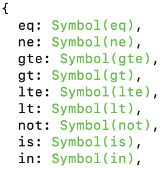

# 07. 관계형 데이터베아스

## 데이터베이스

관련성을 가지며 중복이 없는 데이터들의 집합. 이러한 데이터베이스를 다루는 시스템을 DBMS, 그 중에서도 관계형 데이터베이스를 다루는 시스템을 RDBMS라고 한다. 대표적으로 오라클, MySQL 등이 있다.

## 설치

## db 생성하기

mysql 프롬프트에 접속한다.

CREATE SCHEMA [데이터베이스명]으로 생성한다.

```mysql
CREATE SCHEMA 'nodejs';
CREATE SCHEMA 'nodejs' DEFALUT CHARACTER SET utf8; // 한글 사용 가능 옵션
use nodejs; // 해당 db 사용 명령어
```

## 테이블

데이터가 들어갈 수 있는 틀을 의미하는 테이블을 만든다. CREATE TABLE [데이터베이스명.테이블명] 으로 작성하며 이어지는 ()안에 컬럼 설정이 가능하다.

- 컬럼 : DB의 세로줄을 의미하며 한 가지에 대한 정보가 들어있다.
- 로우 : DB의 가로줄을 의미하며 각 컬럼에 맞춘 데이터 1개씩을 모은 것이다.

```
CREATE TABLE nodejs.users (
    // 컬럼 이름 자료형 옵션 의 형식으로 작성한다.
    id INT NOT NULL AUTO_INCREMENT,
    name VARCHAR(20) NOT NULL,
    ...)
    // 컬럼 설정이 끝난 후에 테이블에 대한 설정을 할 수 있다.
    DEFAULT CHARACTER SET = utf8
    ENGINE = InnoDB; // 세미콜론으로 끝을 알린다.
```

- [ ] 상세 설정들의 역할 정리

테이블 정보 확인과 삭제는 다음과 같다.

```
DESC 테이블명; // 정보 확인
DROP TABLE 테이블명; // 테이블 제거
```

## CRUD

쓰기, 읽기, 수정, 삭제의 4가지 작업이며 데이터베이스에서 주로 하게되는 작업이다.

## Create

데이터를 생성해서 db에 넣는 작업이다.  
INSERT INTO [테이블명] ([컬럼1], [컬럼2], ...) VALUES ([값1], [값2], ...) 으로 사용한다.
해당 테이블에 적은 컬럼 순서대로 적은 값을 순서대로 넣는다.

## Read

db에 있는 데이터를 조회하는 작업이다.

SELECT [컬럼이름] FROM [테이블명] 으로 조회한다. 전체를 조회하고 싶다면 컬럼이름 대신 \* 을 넣으면 된다.

```
SELECT name, age FROM nodejs.users;
```

마지막에 WHERE로 조건을 걸어줄 수 있다.

```
SELECT name, age FROM nodejs.users WHERE age > 30; // age > 30 인 조건을 만족하는 로우의 name, age 데이터를 반환한다.
```

ORDER BY 로 정렬, LIMIT 로 조회할 개수 설정, OFFSET으로 건너뛸 개수 조정도 가능하다.

## Update

db 에 있는 데이터를 수정한다.  
UPDATE [테이블명] SET [컬럼명 = 바꿀 값] WHERE [조건] 으로 사용한다.

```
UPDATE nodejs.users SET comment = '수정' WHERE id = 2; // users 테이블에서 id가 2인 로우의 comment 데이터를 수정 으로 바꾼다.
```

## Delete

db에 있는 데이터를 삭제한다.  
DELETE FROM [테이블명] WHERE [조건] 으로 사용한다.

```
DELETE FROM nodejs.users WHERE id = 2; // users 테이블에서 id가 2인 로우를 삭제한다.
```

## 시퀄라이즈

노드에서 mysql 작업을 쉽게 할 수 있도록 도와주는 라이브러리이다. 이 라이브러리를 사용하면 js 구문을 sql로 바꾸어 주기 때문에 js 만으로 mysql 조작이 가능하다. js 객체와 데이터베이스 릴레이션(정보 저장의 기본 단위)를 매핑시켜주는 ORM 이라는 도구이다.

새 node 프로젝트 생성 후 npm 으로 설치후 실행한다.

```bash
npm i sequelize sequelize-cli
sequelize init
```

init의 결과로 config, models, migrations. seeders 폴더가 생성된다.
<<<<<<< HEAD

### config

config.json을 가지고 있다. 이 파일은 연결할 db의 정보를 담고 있는 파일이다.

```json
{
  "development": {
    "username": "root",
    "password": null,
    "database": "database_development",
    "host": "127.0.0.1",
    "dialect": "mysql"
  },
  "test": {

    ...
}
```

### models

index.js를 기본적으로 가지고 있다. 원래는 이것보다 긴데 책의 저자가 오류가 있어서 수정된 코드를 제공하였다. 이걸로 해도 작동 잘 된다.

```js
const Sequelize = require('sequelize');

const env = process.env.NODE_ENV || 'development';
const config = require('../config/config.json')[env];
const db = {};

const sequelize = new Sequelize(
  config.database,
  config.username,
  config.password,
  config
);

db.sequelize = sequelize;

module.exports = db;
```

코드를 살펴보면 sequelize 를 불러오고, 생성자 함수 호출로 인스턴스를 만들고, 필요한 인수를 아까 config 폴더에 있었던 config.json 파일로부터 가져오고, db 객체 리터럴에 sequelize 프로퍼티로 객체 추가하고, 모듈로 내보냈다.

원래 이런 거 코드 봐도 무슨 말인지 몰랐는데 요즘 js를 공부하다 보니까 코드 해석을 할 수 있어서 즐겁다.

또한 models 폴더 내에서 모델(db의 테이블에 해당하는 것)을 여기에서 js 파일로 정의하게 된다.

### migrations

- [ ] 추가

### seeders

- [ ] 추가

## 연결하기

이제 익스프레스(서버)와 시퀄라이즈를 연결해야 한다.

```js
// app.js

const { sequelize } = require('./models');

...

sequelize.sync({ force: false }).then(() => {
  console.log('db 연결 성공').catch((err) => {
    console.log(err);
  });
});

...
```

models 폴더를 불러와서 그 안에 db.seqeulize를 디스트럭처링 할당으로 가져왔다. 이 때 index.js 는 생략할 수 있다고 한다. (index.js 만 가능)  
연결은 인스턴스가 가지고 있는 sync 메서드를 사용하면 되며 force 를 true로 해 두면 서버 실행시마다 db를 새로 생성한다.

이제 app.js로 서버를 열면 db가 연결된다. 그 전에 config.json에 연결 정보를 입력해 주어야 한다.

```json
  "development": {
    "username": "root",
    "password": "mysql비밀번호",
    "database": "사용할db이름",
    "host": "127.0.0.1",
    "dialect": "mysql"
  },
```

## 모델 정의하기

models 폴더에 js 파일로 모델, 즉 db의 테이블을 생성해 줄 수 있다.  
mysql 콘솔에서 create database 어쩌구 저쩌구 ~ 하던 부분을 js로 대신 하는 것이다. 모듈은 js의 클래스를 이용하여서 만든다.

예시

```js
const Sequelize = require('sequelize');

module.exports = class User extends Sequelize.Model {
  static init(sequelize) {
    return super.init(
      {
        name: {
          type: Sequelize.STRING(20),
          allowNull: false,
          unique: true,
        },
        age: {
          type: Sequelize.INTEGER.UNSIGNED,
          allowNull: false,
        },
        married: {
          type: Sequelize.BOOLEAN,
          allowNull: false,
        },
        comment: {
          type: Sequelize.TEXT,
          allowNull: true,
        },
        created_at: {
          type: Sequelize.DATE,
          allowNull: false,
          defaultValue: Sequelize.NOW,
        },
      },
      {
        sequelize,
        timestamps: false,
        underscored: false,
        modelName: 'User',
        tableName: 'users',
        paranoid: false,
        charset: 'utf8',
        collate: 'utf8_general_ci',
      }
    );
  }

  static associate(db) {
    db.User.hasMany(db.Comment, { foreignKey: 'commenter', sourceKey: 'id' });
  }
};
```

먼저 시퀄라이즈를 import 해왔다. Sequelize.model 을 상속받은 class 로 모델을 구현한다.  
init 이라는 정적 메서드는 sequelize 객체 (index.js 에서 등장한 그것)를 인자로 받아서 수퍼클래스 (Sequelize.Model)의 init 메서드를 테이블 정보를 인자로 받아 리턴한다.
associate 라는 정적 메서드는 db (이것도 index.js에서 등장한 그것) 를 인자로 받아서 모델관의 관계를 설정한다. 마지막으로 User를 모듈로 내보낸다.

이렇게 테이블 생성 관련 쿼리를 js 로 할 수 있다.

이제 models/index.js 와 연결하면 된다. User를 불러오고 아까 만들어둔 db 객체에 프로퍼티로 User를 추가해 준 후 User의 메서드 2개를 호출해 주면 된다.

```js
const Sequelize = require('sequelize');
const User = require('./user');

...

db.sequelize = sequelize;

db.User = User;

User.init(sequelize);

User.associate(db);

module.exports = db;
```

- [ ] 비번 지우기

## 관계 설정하기

아까 associate 메서드에서 관계를 정할 수 있다고 하였다. 예컨대 한 명의 user가 여러 개의 comment를 달 수 있는 1:N 구조를 생각해 보자. comment 테이블이 만들어졌다고 하고 이 둘의 관계를 어떻게 시퀄라이즈에서 설정할까?

### hasMany

hasMany 메서드는 1:N 관계를 정의할 때 사용한다. 아까 User 테이블 만들 때 associate 에서 사용한 바 있다. 1에 해당하는 테이블에 hasMany를 사용하면 되며, 첫 번째 인자로 N의 관계를 가지는 테이블, 두 번째 인자 객체에서 foreignKey 에는 N의 입장에서 외래키로 사용될 컬럼을, sourceKey 에는 외래 키가 참조하는 컬럼을 적는다.

즉 foreignKey 는 상대 테이블, sourceKey 는 hasMany를 사용한 테이블에서 가져오는 것이다.

```js
  static associate(db) {
    db.User.hasMany(db.Comment, { foreignKey: 'commenter', sourceKey: 'id' });
  }
```

### belongsTo

그럼 N에 해당하는 곳에는 무엇을 써야 할까? belongsTo를 사용한다.
이것도 해당 테이블을 정의한 js 파일에 작성하면 된다. 첫 번째 인자는 관계를 가지는(1 역할을 하는) 테이블을, 두 번째 인자 객체의 foreignKey 는 외래키로 사용할 (또는 추가될) 컬럼, targetKey 는 참조할 컬럼을 작성한다.

이번에는 foreignKey 가 자신의 테이블, targetKey 가 상대측 테이블에서 가져오게 된다.

```js
  static associate(db) {
    db.Comments.belongsTo(db.User, { foreignKey: 'commenter', targetKey: 'id' });
  }
```

만약 foreignKey 를 설정하지 않는다면 1 측에 해당하는 모델명 + 기본 키가 합쳐진 컬럼이 자동으로 생성된다. 예컨대 User 테이블은 user 모델을 생성하고, user 모델의 primary key 는 id 였으므로 UserId 라는 컬럼이 **Comment 테이블에 생성된다.**

### hasOne

1대1 관계에서 hasMany 대신 쓰는 것이다. 사용법은 동일하다.

### belongsToMany

N:M 관계를 만들 때 사용된다. 특성 상 어느 한 쪽에 컬럼을 추가해서 관계를 나타낼 수 없으므로, 새로운 모델이 생성된다.  
다음과 같이 쓰면 PostHashtag 모델이 새로 생긴다.

```js
db.Post.belongsToMany(db.Hashtag, { through: 'PostHashtag' });
db.Hasgtag.belongsToMany(db.Post, { through: 'PostHashtag' });
```

## 쿼리 작성하기

### create

이번에는 sql문을 대신하는 쿼리 작성이다. 쿼리는 프로미스를 반환하므로 then 으로 해당 결과값을 사용할 수 있다.  
쿼리문을 사용하고 싶은 파일에서 먼저 모델을 불러온 후 다음과 같이 쓴다.

```js
테이블이름.create({
  컬럼: '값',
});
```

한가지 주의점은 mysql 형식이 아니라 시퀄라이즈식 자료형을 써야 한다는 것이다. 예컨대 boolean 은 true, false로 써야 한다. 그럼 시퀄라이즈가 mysql 형식으로 바꾸어주며 만약 잘못쓰면 시퀄라이즈가 에러를 발생시킨다.

### read

데이터 가져올 때는 findAll 메서드이다. 예컨대 모든 데이터 조회는 다음과 같다.

```js
테이블이름.findAll({});
// 이것은 하나만 가져올 때
테이블이름.findOne({});
```

원하는 컬럼만 가져올 때에는 attributes 를 사용한다.

```js
테이블이름.findAll({ attributes: ['컬럼이름'] });
```

where로 조건을 나열할 수 있다.

```js
테이블이름.findAll({
  attributes: ['컬럼이름'],
  where: { married: true, age: { [Op.gt]: 30 } },
});
```

{ [op.gt]: 30 } 를 보자. 이것은 계산된 프로퍼티 이름으로 프로퍼티를 생성하는 es2015 문법이다. 객체를 통해 쿼리를 생성해야 하므로 특수하게 만들었다고 한다.

실제로 콘솔을 찍어 보면 심벌값들이 정의되어 있는 객체이다. 심벌 값이 문자열로 타입 변환이 되어서 프로퍼티로 추가가 되고 그것이 쿼리로 변하는 식인가 보다.


limit로 가져올 로우 개수를 설정 가능하다. order으로 정렬 가능하다.

### update

수정은 update 를 사용한다. 마찬가지로 where로 조건을 넣어 줄 수 있다.

```js
테이블이름.update({
  컬럼이름: '바꿀 내용',
  where: { id: 2 },
});
```

### delete

삭제는 destroy 를 사용한다. 마찬가지로 where로 조건을 넣어 줄 수 있다.

```js
테이블이름.destory({
  where: { id: 2 },
});
```

## 관계 설정

mysql의 join 기능을 사용하고 싶다면 include를 사용한다.  
예컨대 아까 User와 Comment이 1:N으로 설정되어 있는 예시를 다시 들고 오자. include를 사용해서 findOnd으로 찾은 user가 작성한 comment도 전부 가져올 수 있다. include의 값이 배열로 넣는 이유는 user가 다른 테이블과도 관계를 맺고 있을 수 있기 때문이다.

```js
const user = await User.findOne({
  include: [
    {
      model: Comment,
    },
  ],
});

console.log(user.Comments); // 이렇게 접근이 가능하다.
```

다른 방법도 있다.

```js
const user = await User.findOne({});
const comments = await user.getComments();

console.log(comments); // 바로 위 예제의 user.Comments와 같은 결과를 출력한다.
```

find의 결과를 변수에 할당하고 결과변수.동작이름 + 모델이름 이런 식이다. 그래서 user. + get + Comments 라는 형식으로 된다.
Comment 에 s 가 붙는 이유는 댓글은 여러개 (N에 해당) 일 수도 있기 때문이라고 한다. 그럼 1:1관계로 설정했으면 s를 붙이지 않는 것인가?
